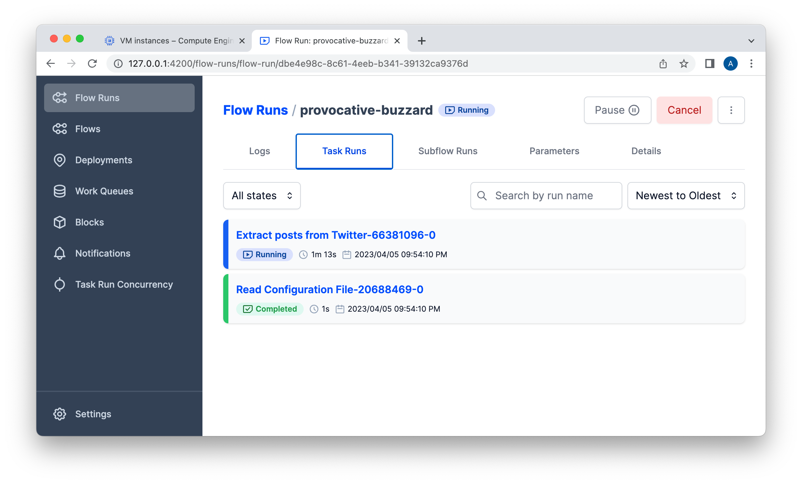

# Twitter #DataEngineering Posts - Data Engineering Zoomcamp Project 2023


Here is my project carried out as part of the Data Engineering Zoomcamp 2023 which consists of putting into practice
everything we have learned.

This project will show how to create a pipeline to pull posts from Twitter with the "#dataengineering" hashtag, store
this data in a Bucket on Google Cloud, process some NLP analysis, save this data in BigQuery, and create a dashboard
using Google Looker.

## Problem description

Twitter is a huge social network overflowing with data in every conceivable field, updated in real time, easily
accessible.

Since I study data engineering, I regularly check posts with the hashtag "#dataengineering" in Twitter. However, I
struggle to find the most interesting and trending posts. Thus, the first objective of this project is to produce a
dashboard helping me to identify the most useful and relevant discussions in social networks. Eventually, I’ll expand my
pipeline to include the 'r/dataengineering' subtwitter.

Also, this project will serve me later in another project that I plan to carry out. I am studying machine learning and
more particularly text analysis with NLP (e.g. sentimental analysis). I think Twitter is an incomparable source of data
for understanding trends, detecting events, understanding the mood of a community. Thus, I hope this project will
subsequently allow me to analyze millions of posts with NLP.

## Project architecture

Data comes from Twitter. They are extracted using
[snscrape](https://betterprogramming.pub/how-to-scrape-tweets-with-snscrape-90124ed006af).

The whole process is orchestrated by the workflow orchestration engine [Prefect](https://www.prefect.io/).

A pipeline gets the data, cleans it, saves first it as a parquet file and than moves to a Data Lake. Another pipeline
gets data from the Data Lake, The second pipeline does some transformations with
[tweetnlp](https://tweetnlp.org/get-started/), and creates a Data Warehouse.

Since my pipeline is a relative short process that handle a small volume of data (about 25,000 tweets), I use the ETL
approach, which stands for Extract, Transform and Load.

The data lake and data warehouse are respectively Bucket and [BigQuery](https://cloud.google.com/bigquery) on [Google
Cloud Platform](https://cloud.google.com/) (GCP).

[Terraform](https://www.terraform.io/) is used as an IaC (Infrastructure as code) to create resources in GCP.

A dashboard was built with [Google Looker](https://cloud.google.com/looker) from BigQuery data.

This diagram presents the high level architecture of the project.


## Dashboard

This is what my final dashboard looks like.

<div class="warning">

Ajouter une image du dashboard. ???

</div>

This dashboard shows the most interesting tweets with the "#dataenginerring" hashtag, the number of tweets and authors,
graphs, etc.

## Reproducibility

You will find below **detailed instructions** for replicating this pipeline from scratch to the dashboard.

I didn’t try to hide instructions in opaque scripts to simplify the steps. Thus, you will be able to better understand
all the pipes that must be connected to create a virtual environment on the cloud and a pipeline digesting the data
until their consumption.

This project has no docker, no docker-compose, no bash scripts, etc…​ This is an editorial choice to help the reader
understand what’s going on.

## Future work

- Add tests.
- Add CI/CD pipeline.
- Github Actions workflow to run Terraform steps (like
  [here](https://towardsdatascience.com/git-actions-terraform-for-data-engineers-scientists-gcp-aws-azure-448dc7c60fcc)).
- Make incremental model, to append only the latest data from each load.
- Transformations, documentation and data quality tests in dbt.
- Dashboard status tiles (like [here](https://docs.getdbt.com/docs/deploy/dashboard-status-tiles)).
- Include `r/dataengineering` subreddit posts.
- More text analysis with NLP.
- Use GPU with my VM instance.
- Streaming process with Kafka and Spark.

## Credits

I want to thank all the instructors at DataTalksClub, especially [Victoria Perez Mola](https://github.com/Victoriapm)
(otherwise I wouldn’t learn so much about dbt), [Jeff Hale](https://github.com/discdiver) (great Prefect materials),
[Anna Geller](https://github.com/anna-geller) (helpful impossible prefect collection posts!) , and, of course, [Alexey
Grigorev](https://github.com/alexeygrigorev) for doing so much for the community.

## License

MIT License.

## Instructions for reproducibility

You will find below **very detailed instructions** for replicating this pipeline from scratch to the dashboard.

The step-by-step instructions consist of several steps:

- Set Up Your Cloud Environment
  - Step 1: Create a project in Google Cloud Platform (GCP)
  - Step 2: Install Google Cloud CLI
  - Step 3: Configure permissions with gcloud CLI
  - Step 4: Install Terraform
  - Step 5: Create resources in GCP using Terraform
- Set Up Your Virtual Machine
  - Step 6: Create SSH key pairs (optional)
  - Step 7: Create SSH config file (optional)
  - Step 8: Install packages on the Virtual Machine
- Set Up and run pipelines
  - Step 9: Edit configuration file
  - Step 10: Setup Prefect
  - Step 11: Run the pipelines
- Step 12: Create dashboard for data visualization
- Step 13: Stop and delete to avoid costs

As [Google Cloud](https://cloud.google.com/free) offer free tier products, this shouldn’t cost you anything unless you
amend the pipeline to extract large amounts of data, or keep infrastructure running for more than 90 days. However,
please check [Google Cloud Free Trial Limits](https://cloud.google.com/free/docs/free-cloud-features), as this may
change.

This was developed using an M1 Macbook Pro. If you’re on Windows or Linux, you may need to amend certain components if
issues are encountered.

### Content of the repository

This repository (<https://github.com/boisalai/twitter-dashboard>) contains only two folders:

- `terraform`: this folder is related to Terraform.

- `scripts`: this folder contains scripts to create Block and run pipelines for Prefect.

### Step 1: Create a new project in Google Cloud Platform

If you do not have a GCP account, [create one now](https://console.cloud.google.com/freetrial/). This tutorial can be
completed using only the services included in the GCP [free tier](https://cloud.google.com/free/).

Even though we are going to use only the free quota, your credit card information is needed. GCP states that it will not
charge you unless you explicitly end your free-trial period, but be careful.

Once you’ve created the account, logging into [Google Cloud Platform (GCP) console](https://console.cloud.google.com).

[Create a new project](https://console.cloud.google.com/projectcreate) in the GCP console. Name this new project
`dtc-de`. Make note of the **project ID** (mine is `dtc-de-382923`). For subsequent steps, you will need to replace the
`PROJECT_ID` with your own **project ID**.

Go to [Compute Engine API](https://console.cloud.google.com/apis/library/compute.googleapis.com), select your project
(mine is `dtc-de`) and click on **ENABLE** button.


This operation may take one minute.

### Step 2: Install Google Cloud CLI

The [Google Cloud CLI](https://cloud.google.com/sdk/gcloud) (gcloud CLI) is a set of tools to create and manage Google
Cloud resources. You can use these tools to perform many common platform tasks from the command line or through scripts
and other automation.

Go to [Install the gcloud CLI](https://cloud.google.com/sdk/docs/install), choose your Operating System (OS), and follow
the installation instructions to install gcloud CLI on your local machine.

Confirm that gcloud is installed with `gcloud -v`.

``` txt
gcloud -v
```

You should see something like this.

``` txt
Google Cloud SDK 421.0.0
bq 2.0.87
core 2023.03.03
gcloud-crc32c 1.0.0
gsutil 5.21
```

### Step 3: Configure permissions with gcloud CLI

Now, we will create an IAM service account to enable Terraform to access your GCP account, so that users are not
directly involved.

From your local machine, run the following command.

``` bash
gcloud auth login
```

**Google Cloud SDK** will ask you for permission to access your Google Account. Click on **Allow** button.

Still from your local machine, run the following commands. Remember that you need to replace the `PROJECT_ID` with your
own (mine is `dtc-de-382923`).

``` bash
PROJECT_ID="dtc-de-382923"
gcloud config set project $PROJECT_ID
gcloud components update
gcloud iam service-accounts create terraform-iam --display-name "terraform-iam"
```

In the Google Cloud console, on the left menu, go to the **IAM & Admin** and select **Service Accounts**. A service
account whose name begins with `terraform-iam@…​` should be created (mine is
`terraform-iam@dtc-de-382923.iam.gserviceaccount.com`).


Next, we have to define the roles.

From your local machine, run the following commands.

Remember that you need to replace the `PROJECT_ID` with your own (mine is `dtc-de-382923`).

``` bash
PROJECT_ID="dtc-de-382923"
gcloud projects add-iam-policy-binding $PROJECT_ID \
--member="serviceAccount:terraform-iam@$PROJECT_ID.iam.gserviceaccount.com" \
--role="roles/editor"
gcloud projects add-iam-policy-binding $PROJECT_ID \
--member="serviceAccount:terraform-iam@$PROJECT_ID.iam.gserviceaccount.com" \
--role="roles/viewer"
gcloud projects add-iam-policy-binding $PROJECT_ID \
--member="serviceAccount:terraform-iam@$PROJECT_ID.iam.gserviceaccount.com" \
--role="roles/storage.admin"
gcloud projects add-iam-policy-binding $PROJECT_ID \
--member="serviceAccount:terraform-iam@$PROJECT_ID.iam.gserviceaccount.com" \
--role="roles/storage.objectAdmin"
gcloud projects add-iam-policy-binding $PROJECT_ID \
--member="serviceAccount:terraform-iam@$PROJECT_ID.iam.gserviceaccount.com" \
--role="roles/bigquery.admin"
```

Now, we will download a JSON key file representing the credentials.

From your local machine, run the following commands.

Remember that you need to replace the `PROJECT_ID` with your own (mine is `dtc-de-382923`).

``` bash
PROJECT_ID="dtc-de-382923"
mkdir ~/.config/gcloud
gcloud iam service-accounts keys create ~/.config/gcloud/terraform.json \
--iam-account=terraform-iam@$PROJECT_ID.iam.gserviceaccount.com
```

Once the key has been downloaded, set your environment variable `GOOGLE_APPLICATION_CREDENTIALS` to the path of your
JSON.

``` bash
export GOOGLE_APPLICATION_CREDENTIALS=~/.config/gcloud/terraform.json
```

From your local machine, run the following command to login again and answer 'Y' to continue.

``` bash
gcloud auth application-default login
```

**Google Auth Library** will ask you for permission to access your Google Account. Click on **Allow** button.

Congratulations! You are now authenticated with the gcloud CLI!

### Step 4: Install Terraform

[Terraform](https://developer.hashicorp.com/terraform/intro) is an infrastructure as code tool that lets you build,
change, and version cloud and on-prem resources safely and efficiently.

Go to [Install Terraform](https://developer.hashicorp.com/terraform/downloads?product_intent=terraform), choose version
for your Operating System (OS), and follow the installation instructions to install Terraform on your local machine.

Confirm that Terraform is installed with `terraform -version`.

``` txt
terraform -version
```

You should see something like this.

``` txt
Terraform v1.4.0
on darwin_arm64
```

### Step 5: Create resources in GCP using Terraform

We will now create the resources in our google cloud project. Instead of creating these resources manually, it is easier
to create them programmatically.

With Terraform installed, you are ready to create infrastructure.

Clone this repository somewhere to your local machine.

``` bash
git clone https://github.com/boisalai/twitter-dashboard.git
```

This repository contains two files related to Terraform:

- `twitter-dashboard/terraform/main.tf` contains the main set of configuration for our project.
- `twitter-dashboard/terraform/variables.tf` contain the variable definitions for our project.

In `twitter-dashboard/terraform/variables.tf` file, you must replace the values of certain parameters with your own:

- Variable `project` for your `PROJECT_ID` (mine is `dtc-de-382923`).
- Variable `region` for a region near you (mine is `northamerica-northeast1`). Choose your location
  [here](https://cloud.google.com/about/locations), ideally offering low carbon intensity,
- Variable `zone`, used for the virtual machine (mine is `northamerica-northeast1-a`). See [Available regions and
  zones](https://cloud.google.com/compute/docs/regions-zones#available).

Save and close the `twitter-dashboard/terraform/variables.tf` file.

When you create a new configuration with Terraform, you need to initialize the directory.

From your local machine, run [terraform init](https://www.terraform.io/docs/commands/init.html) to initialize the
working directory.

``` bash
cd
cd twitter-dashboard/terraform/
terraform init
```

You should see this.


Next, run [terraform validate](https://www.terraform.io/docs/commands/validate.html) to validate Terraform configuration
files on the local machine.

``` bash
terraform validate
```

You should see this.


Next, run [terraform plan](https://developer.hashicorp.com/terraform/cli/commands/plan) to validate that Terraform
configuration files from a remote services perspective.

``` bash
terraform plan
```

Terraform will indicate what infrastructure changes it plans to make.

You should see this.


Finally, run [terraform apply](https://developer.hashicorp.com/terraform/cli/commands/apply) to execute the actions
proposed in a Terraform plan and apply the configuration concretely on your project in Google Cloud.

``` bash
terraform apply
```

Respond to the confirmation prompt with a `yes`.

The last two commands may take some times to run.

After that, you should see somethig like this in your terminal.

``` txt
google_bigquery_dataset.dataset: Creating...
google_storage_bucket.data-lake-bucket: Creating...
google_compute_instance.instance: Creating...
google_bigquery_dataset.dataset: Creation complete after 1s [id=projects/dtc-de-382923/datasets/sp500dw]
google_storage_bucket.data-lake-bucket: Creation complete after 1s [id=twitter_data_lake_dtc-de-382923]
google_compute_instance.instance: Still creating... [10s elapsed]
google_compute_instance.instance: Creation complete after 14s [id=projects/dtc-de-382923/zones/northamerica-northeast1-a/instances/twitter-vm]

Apply complete! Resources: 3 added, 0 changed, 0 destroyed.
```

In the Google Cloud console, on the left menu, go to the **Compute Engine** and **VM instances**. You shold see a new
Virtual Machine (VM) instance (mine is `twitter-vm`) on Ubuntu 20.04.5 LTS with 4vCPUs, 16 GB of memory and 100 GB of
disk space.


Take note of your `EXTERNAL_IP`. We will need it later.

In the Google Cloud console, on the left menu, go to the **Cloud Storage** and **Buckets**. You shold see a new a new
Compute Engine Bucket (mine is `twitter_data_lake_dtc-de-382923`).


In the Google Cloud console, on the left menu, go to the **Big Query**. You shold see a new a new BigQuery Dataset (mine
is `dtc-de-382923.twitter`).


If these three services are created, everything is fine and we can move on to the next step.

### Step 6: Create SSH key pairs (optional)

In order to avoid typing the password each time to connect to the VM from the local machine, you can create an SSH key
pairs on the local machine.

Follow the instructions below according to your Operating System (OS).

#### Linux and macOS

For Linux and macOS, run the following command. Replace the `USERNAME` on your computer. Replace also `KEY_FILENAME`
with a more common filename like `my-ssh-key`.

``` bash
ssh-keygen -t rsa -f ~/.ssh/KEY_FILENAME -C USERNAME -b 2048
```

`ssh-keygen` saves your private key file to `~/.ssh/KEY_FILENAME` and your public key file to `~/.ssh/KEY_FILENAME.pub`.

#### Windows 10 or later

For Windows 10 or later, see these
[instructions](https://cloud.google.com/compute/docs/connect/create-ssh-keys#windows-10-or-later).

`ssh-keygen` saves your private key file to `C:\Users\WINDOWS_USER\.ssh\KEY_FILENAME` and your public key file to
`C:\Users\WINDOWS_USER\.ssh\KEY_FILENAME.pub`.

#### Add SSH keys to VM

Next, copy and upload the public key `KEY_FILENAME.pub` to GCP.

In the Google Cloud console, select **Compute Engine** from the left menu, then **Metadata**, select **SSH KEYS** tab,
click on **ADD SSH KEY** button.

Paste the public key in the field, and click on **SAVE** button.

Here, a trick to copy the contents of your public `KEY_FILENAME.pub` file. Just run the following command.

``` bash
cat ~/.ssh/KEY_FILENAME.pub | pbcopy
```

### Step 7: Create SSH config file (optional)

Next, create a file `~/.ssh/config` on your local machine.

``` bash
touch ~/.ssh/config
```

Edit the file et add this content.

``` bash
Host twitter-vm
    HostName EXTERNAL_IP
    User USERNAME
    IdentityFile ~/.ssh/KEY_FILENAME
```

Replace the following:

- `EXTERNAL_IP`: the external IP of the VM instance.
- `USERNAME`: your username on the VM, either the same username used to generate the SSH key.
- `~/.ssh/KEY_FILENAME`: the path of the private SSH key. Note that it has to be absolute path for Windows.

To access your virtual machine, just run this command:

``` bash
ssh twitter-vm
```

Respond to the confirmation prompt with a `yes`.

Eureka! You should see this something like this.

``` txt
The authenticity of host 'XXX.XXX.XXX.XXX (XXX.XXX.XXX.XXX)' can't be established.
ED25519 key fingerprint is SHA256:Cb5xffksisnldfglkw98sdidf9d8sg09ad8g+FB71c.
This key is not known by any other names
Are you sure you want to continue connecting (yes/no/[fingerprint])? yes
Warning: Permanently added 'XXX.XXX.XXX.XXX' (EDXXXXX) to the list of known hosts.
Welcome to Ubuntu 20.04.5 LTS (GNU/Linux 5.15.0-1030-gcp x86_64)

 * Documentation:  https://help.ubuntu.com
 * Management:     https://landscape.canonical.com
 * Support:        https://ubuntu.com/advantage

  System information as of Thu Apr  6 00:17:09 UTC 2023

  System load:  0.0               Processes:             116
  Usage of /:   1.9% of 96.73GB   Users logged in:       0
  Memory usage: 1%                IPv4 address for ens4: XXX.XXX.XXX.XXX
  Swap usage:   0%

Expanded Security Maintenance for Applications is not enabled.

0 updates can be applied immediately.

Enable ESM Apps to receive additional future security updates.
See https://ubuntu.com/esm or run: sudo pro status


The list of available updates is more than a week old.
To check for new updates run: sudo apt update


The programs included with the Ubuntu system are free software;
the exact distribution terms for each program are described in the
individual files in /usr/share/doc/*/copyright.

Ubuntu comes with ABSOLUTELY NO WARRANTY, to the extent permitted by
applicable law.

boisalai@twitter-vm:~$
```

Otherwise, without `~/.ssh/config` file, you need to run this command:

``` bash
ssh -i ~/.ssh/gcp USERNAME@EXTERNAL_IP
```

Where `USERNAME` is your username on the VM and `EXTERNAL_IP` is the external IP of the VM.

### Step 8: Install packages on the Virtual Machine

On your VM instance, run the following commands to download and install Anaconda for Linux.

Remember that you can run the `ssh twitter-vm` command from your local machine to easily access your remote instance.

``` bash
cd
wget https://repo.anaconda.com/archive/Anaconda3-2022.10-Linux-x86_64.sh
bash Anaconda3-2022.10-Linux-x86_64.sh
rm Anaconda3-2022.10-Linux-x86_64.sh
source ~/anaconda3/bin/activate
source ~/.bashrc
```

Still on your VM instance, run the following commands to create a conda environment and install necessary packages.

``` bash
cd
git clone https://github.com/boisalai/twitter-dashboard.git
conda create -n myenv python=3.9
conda activate myenv
conda install pip
conda update -n base -c defaults conda
pip install -r ~/twitter-dashboard/requirements.txt
pip install git+https://github.com/JustAnotherArchivist/snscrape.git
```

After that, you have a conda environment `myenv` with all required libraries installed.

### Step 9: Edit configuration file

Next, you’ll need to create a configuration file with your details for the orchestration workflow.

On your VM instance, create a configuration file `~/twitter-dashboard/scripts/configuration.conf`.

``` bash
cd ~/twitter-dashboard/scripts
touch configuration.conf
```

Copy in the following.

``` conf
[gcp_config]
project_id = PROJECT_ID
data_lake_bucket = twitter_data_lake
bucket_filename = twitter-posts
bq_dataset = twitter
bq_table = posts

[prefect_config]
gcp_credentials = twitter-gcp-creds
gcs_bucket_block_name = twitter-gcs

[twitter_config]
hashtag = #dataengineering
limit = 50000
```

Replace the `PROJECT_ID` with your own (mine is `dtc-de-382923`).

#### Connect to Host with VS Code

To edit a file on a remote machine, you could use Vim, nano or Visual Studio Code (VS Code).

I prefer the third option and connect Visual Studio Code (VS Code) to the remote machine.

In VS Code, go to the **Command Palette** (`Shift+Cmd+P`), select **Remote-SSH: Connect to Host…​**, and select your VM
instance `twitter-vm`. A new VS Code window should appear.

You now access the directories and files of your virtual machine with VS Code as if it were on your own machine.


### Step 10: Setup Prefect

[Prefect](https://www.prefect.io/) is a modern workflow orchestration tool for coordinating all of our data tools.

On your VM instance, start the Prefect Orion orchestration engine with the folowing commands.

Remember that you can run the `ssh twitter-vm` command from your local machine to easily access your remote instance.

``` bash
conda activate myenv
prefect orion start
```

You should see this.


Still on your VM instance, open another terminal window and run the following commands.

Remember that you can run the `ssh twitter-vm` command from your local machine to easily access your remote instance.

``` bash
conda activate myenv
prefect profile use default
prefect config set PREFECT_API_URL=http://127.0.0.1:4200/api
```

You should see this.


If you haven’t already, connect your VS Code to your remote machine as shown in the previous step.

In this new VS Code window, open the terminal, click on **PORTS** tab, click on **Forward a Port** button, and enter the
port `4200`.


Check out the dashboard at <http://127.0.0.1:4200>.


To allow Prefect to orchestrate the pipeline, permissions must be granted to Prefect to access other services. For this,
Blocks must be set up in Prefect, namely GCP Credentials, GCP Bucket…​

Instead of adding these blocks manually, it is easier to add them programmatically.

From the VS Code linked to your VM instance, create the `twitter-dashbord/scripts/make_gcp_block.py` script on your VM
instance.

Copy in the following.

``` python
from prefect_gcp import GcpCredentials
from prefect_gcp.cloud_storage import GcsBucket

# Replace this PLACEHOLDER dict with your own service account info
# See https://prefecthq.github.io/prefect-gcp/
service_account_info = {
  # COPY HERE THE CONTENT OF THE TERRAFORM.JSON FILE
}

GcpCredentials(
    service_account_info=service_account_info
).save("twitter-gcp-creds", overwrite=True)

# Insert your GCS bucket name.
bucket_block = GcsBucket(
    gcp_credentials=GcpCredentials.load("twitter-gcp-creds"),
    bucket="twitter_data_lake_dtc-de-382923",
)

bucket_block.save("twitter-gcs", overwrite=True)
```

Replace the following:

- `service_account_info` by the content of the `terraform.json` file you created earlier.
- `bucket` by your GCS bucket name (mine is `twitter_data_lake_dtc-de-382923`).

Here a trick to copy the contents of a file. From your local machine, run this command.

``` bash
cat ~/.config/gcloud/terraform.json | pbcopy
```

**Warning!** Remember to never push to GitHub the script with your credentials inside.

On your VM instance, run the following commands:

``` bash
conda activate myenv
cd ~/twitter-dashboard
python scripts/make_gcp_block.py
```

No message appears. Don’t worry. It should have worked.

### Step 11: Run the pipelines

We have two pipelines:

- The first retrieves the data from Twitter, cleans it and places it in a Data Lake.
- The second one moves the data from the lake to a Data Warehouse.

#### From Data Source to Data Lake

Let’s start with the first pipeline.

To extract data from Twitter, I chose
[snscrape](https://betterprogramming.pub/how-to-scrape-tweets-with-snscrape-90124ed006af).

This tool didn’t seem to impose limits on the number of queries and tweets retrieved, unlike other tools like
[tweepy](https://docs.tweepy.org/en/stable/) that use the [Twitter
API](https://developer.twitter.com/en/docs/platform-overview) which [limits
requests](https://developer.twitter.com/en/docs/twitter-api/v1/rate-limits). The other tool
[twint](https://github.com/twintproject/twint) does not use Twitter API but is recently archived.

On your VM instance, run the following commands.

``` bash
cd ~/twitter-dashboard
conda activate myenv
prefect deployment build scripts/web_to_gcs.py:web_to_gcs -n twitter -o scripts/web_to_gcs-deployment.yaml
prefect deployment apply scripts/web_to_gcs-deployment.yaml
prefect deployment run "web-to-gcs/twitter"
prefect agent start -q "default"
```

When running this first pipeline, you should see this in the Prefect Orion interface (<http://127.0.0.1:4200/>).




Also, you should see this in your terminal.


This request takes time. Let this work still run for about 20 minutes.

After that, all tasks should be completed successfully.


Go to Google Cloud Console, in the left menu select **Cloud Storage**, then select **Buckets**.

You should see your dataset `twitter-posts.parquet`.


#### From Data Lake to Data Warehouse

The second pipeline reads that dataset from the Cloud Storage bucket, does some transformations with
[tweetnlp](https://tweetnlp.org/get-started/).

Specifically, it cleans the tweets and determines the topic with the highest probability, product, and corporation.

Finally, it saves the tweet data to a Data Warehouse BigQuery.

``` bash
cd ~/twitter-dashboard
conda activate myenv
prefect deployment build scripts/gcs_to_bq.py:gcs_to_bq -n twitter -o scripts/gcs_to_bq-deployment.yaml
prefect deployment apply scripts/gcs_to_bq-deployment.yaml
prefect deployment run "gcs-to-bq/twitter"
prefect agent start -q "default"
```

The last step takes time to execute (about 2 hours!). It would probably have been necessary to reserve a virtual machine
with GPUs to speed up the calculations.

When finished see should see this on Google Cloud Console, BigQuery section.


Insérer une image. ???


Great! Tweet data is ready for visualization.

### Step 12: Create dashboard for data visualization

Now that we have our data, let’s build a dashboard to visualize the data.

Looker is a tool that helps you explore, share, and visualize your company’s data so that you can make better business
decisions.

Go to [Looker Studio](https://lookerstudio.google.com/u/0/) and follow these steps:

- Create a **Data source**.
- Select **BigQuery**.
- **Authorize** Looker Studio to connect to your **BigQuery** project.
- Select **Project Id** `dtc-de`.
- Select **Dataset** `twitter`.
- Select **Table** `posts`.
- Click on **CONNECT** button.

<table>
<tr><td>

</td><td>

</td></tr>
</table>

Click on **CREATE REPORT** button.

You can now feel free to create some visualisations.

Looker tutorials can be found [here](https://cloud.google.com/looker/docs/intro).

### Step 13: Stop and delete to avoid costs

To avoid incurring unnecessary charges to your GCP account, destroy all remote objects managed by a our Terraform
configuration

On your local machine, run this command.

``` bash
terraform destroy
```

You can also manually delete your Virtual Environment, Bucket and BigQuery ressource and perhaps your Google Cloud
project.

## Additional material

During the development of my project, I searched for using Spark in Prefect. Considering the small volume of data
(around 25,000 tweets) I ended up not using Spark for my project.

Despite this, here I present how to install and use Spark. It might be useful to someone.

Here we’ll show you how to install et use Spark 3.3.2 for Linux on Prefect.

### Install Java

Download OpenJDK 11 or Oracle JDK 11 (It’s important that the version is 11 - spark requires 8 or 11)

We will use [OpenJDK](https://jdk.java.net/archive/).

On your VM instance, download this file in `~/spark` directory, unpack it and and remove the archive.

``` bash
cd
mkdir spark
cd spark
wget https://download.java.net/java/GA/jdk11/9/GPL/openjdk-11.0.2_linux-x64_bin.tar.gz
tar zxvf openjdk-11.0.2_linux-x64_bin.tar.gz
rm openjdk-11.0.2_linux-x64_bin.tar.gz
```

On your VM instance, define `JAVA_HOME`, add it to `PATH` and check that it works with the following commands.

``` bash
echo 'export JAVA_HOME="$HOME/spark/jdk-11.0.2"' >> ~/.bashrc
echo 'export PATH="$JAVA_HOME/bin:$PATH"' >> ~/.bashrc
source ~/.bashrc
java --version
```

You should see this output.

``` txt3
openjdk 11.0.2 2019-01-15
OpenJDK Runtime Environment 18.9 (build 11.0.2+9)
OpenJDK 64-Bit Server VM 18.9 (build 11.0.2+9, mixed mode)
```

## Install Spark

On your VM instance, download Spark 3.3.2, unpack it and remove the archive.

``` bash
cd ~/spark
wget https://dlcdn.apache.org/spark/spark-3.3.2/spark-3.3.2-bin-hadoop3.tgz
tar xzfv spark-3.3.2-bin-hadoop3.tgz
rm spark-3.3.2-bin-hadoop3.tgz
```

Add it to PATH and start Spark shell with the following commands.

``` bash
echo 'export SPARK_HOME="$HOME/spark/spark-3.3.2-bin-hadoop3"' >> ~/.bashrc
echo 'export PATH="$SPARK_HOME/bin:$PATH"' >> ~/.bashrc
source ~/.bashrc
spark-shell
```

You shoud see this output.


Congratulation! We have successfully installed Apache Spark on Linux!

To close Spark shell, you press `CTLR+D` or simply type in `:quit` or `:q`.

### Install PySpark

To run PySpark, we first need to add it to `PYTHONPATH`.

On your VM instance,run the following commands.

``` bash
echo 'export PYTHONPATH="$SPARK_HOME/python/:$PYTHONPATH"' >> ~/.bashrc
echo 'export PYTHONPATH="$SPARK_HOME/python/lib/py4j-0.10.9.5-src.zip:$PYTHONPATH"' >> ~/.bashrc
source ~/.bashrc
```

### Prefect pipeline

Here is a skeleton of a script for Prefect using Spark to process data

``` python
from prefect import task, Flow, resource_manager

from pyspark import SparkConf
from pyspark.sql import SparkSession

@resource_manager
class SparkCluster:
    def __init__(self, conf: SparkConf = SparkConf()):
        self.conf = conf

    def setup(self) -> SparkSession:
        return SparkSession.builder.config(conf=self.conf).getOrCreate()

    def cleanup(self, spark: SparkSession):
        spark.stop()

@task
def get_data(spark: SparkSession):
    return spark.createDataFrame([('look',), ('spark',), ('tutorial',), ('spark',), ('look', ), ('python', )], ['word'])

@task(log_stdout=True)
def analyze(df):
    word_count = df.groupBy('word').count()
    word_count.show()


with Flow("spark_flow") as flow:
    conf = SparkConf().setMaster('local[*]')
    with SparkCluster(conf) as spark:
        df = get_data(spark)
        analyze(df)

if __name__ == '__main__':
    flow.run()
```


